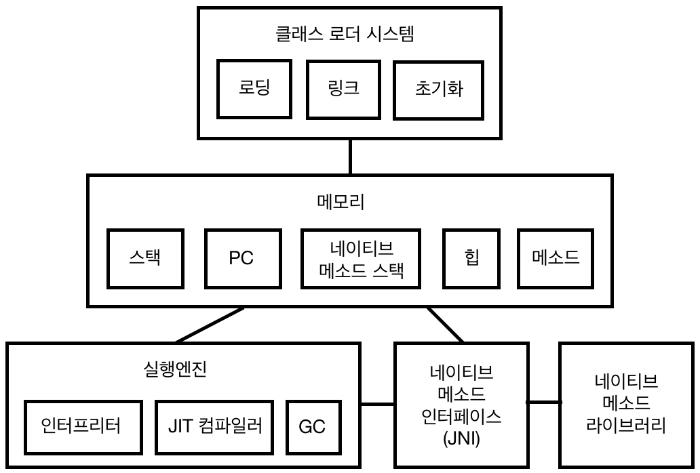
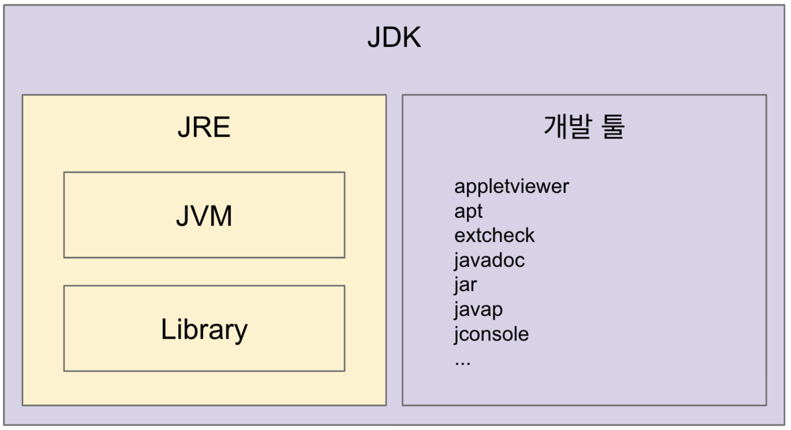

 

## 1주차 과제: JVM은 무엇이며 자바 코드는 어떻게 실행하는 것인가. 
자바 소스 파일(.java)을 JVM으로 실행하는 과정 이해하기.
***
### 학습할 것
- JVM이란 무엇인가
- 컴파일 하는 방법
- 실행하는 방법
- 바이트코드란 무엇인가
- JIT 컴파일러란 무엇이며 어떻게 동작하는지
- JVM 구성 요소
- JDK와 JRE의 차이
***
   

# JVM이란 무엇인가
- 바이트코드를 OS가 이해할 수 있도록 해석하고 실행하는 가상 머신. 
('바이트 코드' 아니다. '바이트코드'다.) 
- JVM은 OS에 종속적이지만,  
자바는 OS에 상관없이 JVM만 있으면 자바 코드를 변경하지 않고 사용할 수 있다. 
- JVM은 바이트코드를 실행하는 것일 뿐 자바에 종속적이지 않다. 
코틀린, 스칼라, 그루비 등 바이트코드로 변환만 할 수 있으면 JVM에서 실행할 수 있다.  
    

# 컴파일 하는 방법
 
###### (이미지 출처: 책 'Think Java, 2nd Edition' - Allen B. Downey, Chris Mayfield)

 JDK에 들어있는 javac를 사용하여 자바 소스를 바이트코드(클래스 파일)로 컴파일한다. 
커맨드창을 실행해서 아래처럼 직접 명령을 주거나 IDE를 사용해서 컴파일할 수 있다.  
<pre>
$ javac [자바 소스코드 파일]
</pre>
<pre>
$ javac Hello.java
</pre>
## 컴파일 옵션
명령어로 'javac'만 실행하면 javac의 명령 옵션을 확인할 수 있다.  
<pre>
$ javac 
</pre>
<pre>
$ javac -version                                => 자바 컴파일러 버전 확인.
    
$ javac -classpath hello.jar:. Hello.java       => 클래스 패스 설정. (디폴트: 현재 디렉토리) 
    
$ javac -d /home/owner/java/classes Hello.java

$ javac -enable-preview
</pre>
   

# 실행하는 방법
'java' 명령어로 클래스명을 주어 실행한다.
<pre>
$ java [클래스명]
</pre>
<pre>
$ java Hello
</pre>
## 실행 옵션 
명령어로 'java'만 실행하면 java의 명령 옵션을 확인할 수 있다.  
<pre>
$ java 
</pre>
<pre>
$ java -c  
</pre>
   

# 바이트코드란 무엇인가
- 가상머신이 해석할 수 있는 중간 코드이다.
- 자바에서 JIT 컴파일러가 생기기 전까지는.. 
자바 바이트코드를 JVM의 인터프리터가 한 줄씩 기계어로 번역한 후 실행했기 때문에 
무겁고 속도가 느리다는 문제점이 있었다. 
    

# JIT 컴파일러란 무엇이며 어떻게 동작하는지
- 런타임 시, 바이트코드를 실행하는 시점에 동작한다.  
- JIT 컴파일러가 바이트코드를 기계어로 변환하여 캐싱해 두었다가 
같은 함수가 또 나오면 새로운 기계어를 생성하지 않고, 이전에 캐싱해둔 기계어를 사용하도록 한다.  
- JIT 컴파일러로 인한 최적화 덕분에 성능이 크게 향상되었다.  
    

# JVM 구성 요소
 
###### (이미지 출처: 직접 그려봅니다.)
    

# JDK와 JRE의 차이
 
###### (이미지 출처: 백기선님의 '더 자바, 코드를 조작하는 다양한 방법' 인프런 강의 자료.
https://www.inflearn.com/course/the-java-code-manipulation)
    