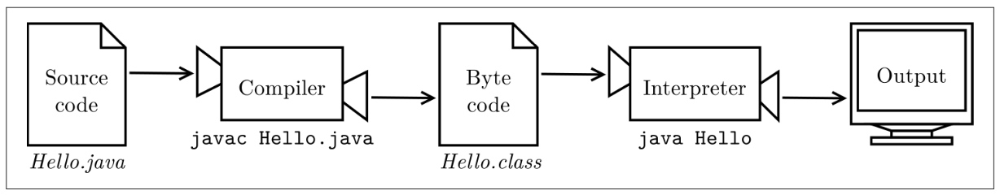

## 1주차 과제: JVM은 무엇이며 자바 코드는 어떻게 실행하는 것인가. 
자바 소스 파일(.java)을 JVM으로 실행하는 과정 이해하기.
***
### 학습할 것
- JVM이란 무엇인가
- 컴파일 하는 방법
- 실행하는 방법
- 바이트코드란 무엇인가
- JIT 컴파일러란 무엇이며 어떻게 동작하는지
- JVM 구성 요소
- JDK와 JRE의 차이
***
     

# JVM이란 무엇인가
- 바이트코드를 OS가 이해할 수 있도록 해석하고 실행하는 가상 머신. 
('바이트 코드' 아니다. '바이트코드'다.) 
- JVM은 OS에 종속적이지만,  
자바는 OS에 상관없이 JVM만 있으면 자바 코드를 변경하지 않고 사용할 수 있다. 
- JVM은 바이트코드를 실행하는 것일 뿐 자바에 종속적이지 않다. 
코틀린, 스칼라, 그루비 등 바이트코드로 변환만 할 수 있으면 JVM에서 실행할 수 있다.  
   

# 컴파일 하는 방법
 
>이미지 출처: 책 'Think Java, 2nd Edition' - Allen B. Downey, Chris Mayfield

JDK에 들어있는 javac를 사용하여 자바 소스를 바이트코드(클래스 파일)로 컴파일한다. 
커맨드창을 실행해서 아래처럼 직접 명령을 주거나 IDE를 사용해서 컴파일할 수 있다.  
<pre>
$ javac test.java
</pre>
## 컴파일 옵션
명령어 'javac'만 입력하면 javac의 명령 옵션을 확인할 수 있다.  
<pre>
$ javac -version  // 자바 컴파일러 버전 확인.
$ javac -classpath test.jar:. test.java    // 클래스 패스 설정. (디폴트: 현재 디렉토리) 
$ javac -d /home/owner/java/classes test.java  // 
$ javac -enable-preview
</pre>
  

# 실행하는 방법
'java' 명령어로 클래스명을 주어 실행한다.
<pre>
$ java [클래스명]
</pre>
<pre>
$ java test
</pre>
## 실행 옵션 
  

# 바이트코드란 무엇인가
- 가상머신이 해석할 수 있는 중간 코드이며, 인터프리터 언어이다.
- 자바 소스를 컴파일한 자바 바이트코드는 JVM의 인터프리터가 한 줄씩 해석하여 실행한다.
때문에, JIT 컴파일러가 생기기 전까지는 무겁고 느렸다.
  

# JIT 컴파일러란 무엇이며 어떻게 동작하는지
  

# JVM 구성 요소
  

# JDK와 JRE의 차이
  