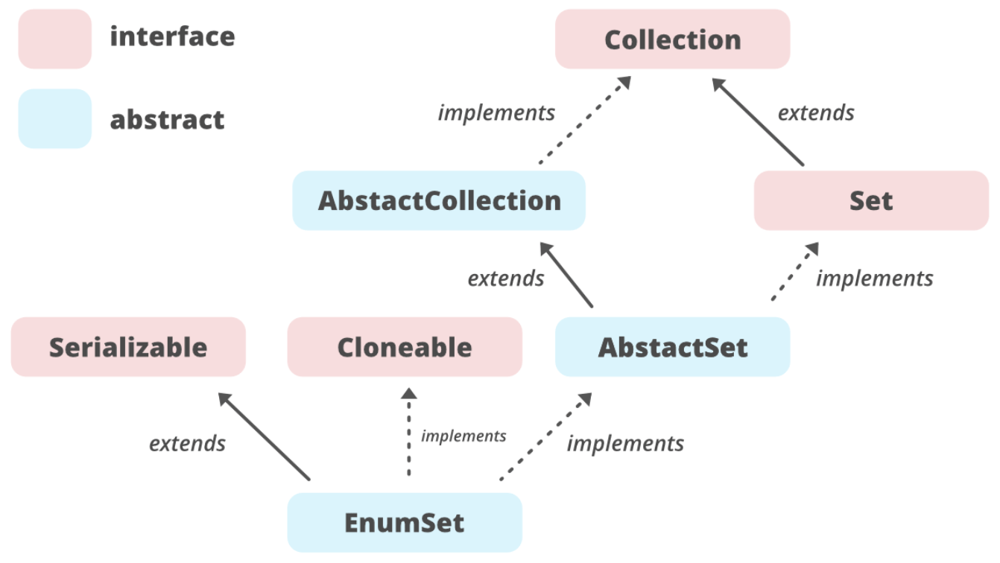

 

## 11주차 과제: Enum 
자바의 열거형에 대해 학습하세요.
*** 
### 학습할 것 (필수)
- enum 정의하는 방법
- enum이 제공하는 메소드 (values()와 valueOf())
- java.lang.Enum
- EnumSet
***
    

# enum 정의하는 방법
enum은 변수가 미리 정의된 상수 집합이 되도록 하는 데이터 유형이다.  
enum 변수는 enum에 정의된 값 중 하나이어야 한다. 
나침반 방향(동/서/남/북) 혹은 요일(월/화/수/목/금/토/일)과 같이 관련이 있는 상수들의 집합으로 정의한다. 
상수이기 때문에 enum의 필드들은 대문자로 정의한다.  
<pre>
public enum Day {
    SUNDAY, MONDAY, TUESDAY, WEDNESDAY,
    THURSDAY, FRIDAY, SATURDAY 
}
</pre>
위에서 정의한 enum을 다음과 같이 사용할 수 있다.
<pre>
public class EnumTest {
    Day day;
    
    public EnumTest(Day day) {
        this.day = day;
    }
    
    public void tellItLikeItIs() {
        switch (day) {
            case MONDAY:
                System.out.println("Mondays are bad.");
                break;
                    
            case FRIDAY:
                System.out.println("Fridays are better.");
                break;
                         
            case SATURDAY: case SUNDAY:
                System.out.println("Weekends are best.");
                break;
                        
            default:
                System.out.println("Midweek days are so-so.");
                break;
        }
    }
    
    public static void main(String[] args) {
        EnumTest firstDay = new EnumTest(Day.MONDAY);
        firstDay.tellItLikeItIs();
        EnumTest thirdDay = new EnumTest(Day.WEDNESDAY);
        thirdDay.tellItLikeItIs();
        EnumTest fifthDay = new EnumTest(Day.FRIDAY);
        fifthDay.tellItLikeItIs();
        EnumTest sixthDay = new EnumTest(Day.SATURDAY);
        sixthDay.tellItLikeItIs();
        EnumTest seventhDay = new EnumTest(Day.SUNDAY);
        seventhDay.tellItLikeItIs();
    }
}
</pre>
혹은 enum 생성자를 사용하면 각 필드에 추가적으로 다른 정보를 추가할 수 있다.
<pre>
public enum Day {
    SUNDAY(1), MONDAY(2), TUESDAY(3), WEDNESDAY(4),
    THURSDAY(5), FRIDAY(6), SATURDAY(7); 
    
    Day(int value) {
        this.value = value;
    }
}
</pre>
    

# enum이 제공하는 메소드 (values()와 valueOf())
### values()
enum에 정의한 필드를 배열로 반환해준다.
<pre>
for(Day day : Day.values()) {
    System.out.println(day);
}
</pre>

### valueOf()
enum에 정의된 필드 중 특정 필드를 가져올 수 있다. 
<pre>
Day sunday = Day.valueOf("SUNDAY");
</pre>
    

# java.lang.Enum
모든 enum은 암시적으로 java.lang.Enum 클래스를 상속받는다. 
자바는 다중상속을 지원하지 않으므로 enum은 다른 클래스를 상속 받을 수 없다.  
java.lang.Enum을 상속받기 때문에 java.lang.Enum에 정의되어 있는 메소드들을 사용할 수 있다.  
<pre>
System.out.println(Day.SUNDAY.name()); // SUNDAY

System.out.println(Day.SUNDAY.compareTo(Day.MONDAY)); // -1 

System.out.println(Day.SUNDAY.equals(Day.SUNDAY)); // true

System.out.println(Day.WEDNESDAY.ordinal()); // 3 

System.out.println(Day.WEDNESDAY.toString()); // WEDNESDAY
</pre>
    

# EnumSet
  
enum을 컬렉션의 Set을 상속받는 EnumSet으로 만들어서 사용할 수 있다.
<pre>
// 1. of: enum값들로 EnumSet을 만든다.
System.out.println("# 1. of: " + EnumSet.of(Day.THURSDAY, Day.SATURDAY, Day.WEDNESDAY));

// 2. complementOf: 전달한 enum값들 중 없는 enum값들로 EnumSet을 만든다. 
System.out.println("# 2. complementOf: " + EnumSet.complementOf(EnumSet.of(Day.THURSDAY, Day.SATURDAY, Day.WEDNESDAY)));

// 3. allOf: enum으로 만든 클래스로 EnumSet을 만든다. 
System.out.println("# 3. allOf: " + EnumSet.allOf(Day.class));

// 4. range: enum에 정의된 필드의 범위를 전달하여 EnumSet을 만든다. 
System.out.println("# 4. range: " + EnumSet.range(Day.MONDAY, Day.FRIDAY));

// 5. iterator: enum으로 만든 클래스를 Iterator 클래스로 만들어서 사용할 수 있다. 
Iterator❮Day❯ iterator = EnumSet.allOf(Day.class).iterator();
System.out.print("# 5. iterator: ");
while (iterator.hasNext()) {
    System.out.print(iterator.next() + " ");
}
</pre>
https://www.geeksforgeeks.org/enumset-class-java  
    
