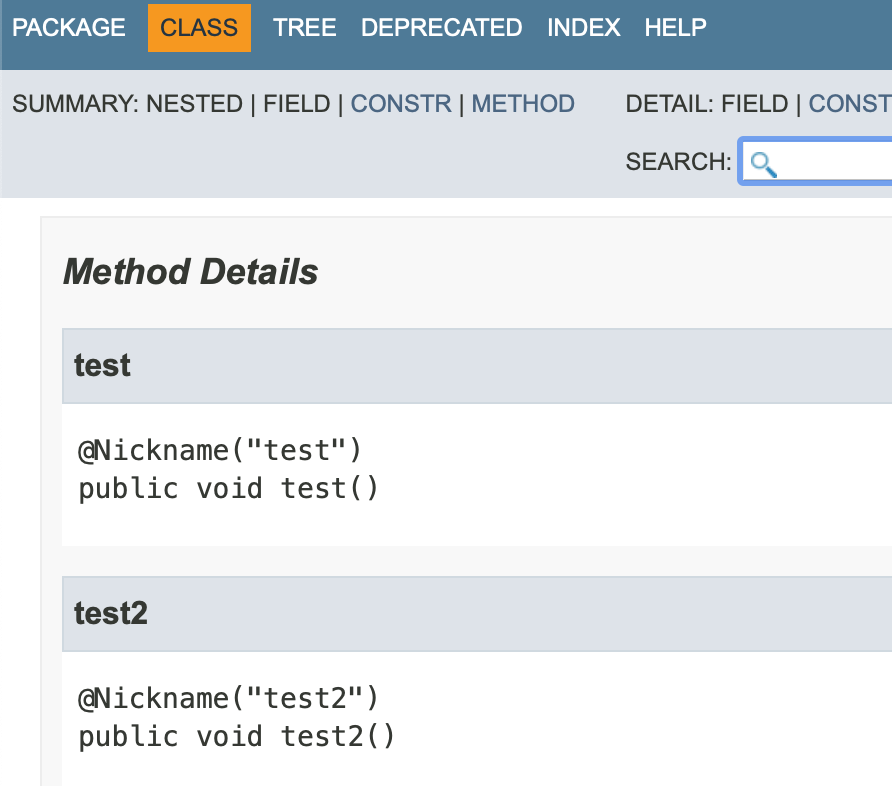

 

## 12주차 과제: 애노테이션 
자바의 애노테이션에 대해 학습하세요.
*** 
### 학습할 것 (필수)
- 애노테이션 정의하는 방법
- @retention
- @target
- @documented
- 애노테이션 프로세서
***
    

# 애노테이션 정의하는 방법
애노테이션은 자바 프로그램에 주석을 다는 것이다. 애노테이션 자체가 무엇을 실행하는 것은 아니다. 
예를 들어, @Override의 경우 부모클래스의 메소드를 오버라이딩한 메소드임을 의미한다. 
이 애노테이션은 컴파일러와 IDE에게 유용한 힌트를 제공한다. 만약, 오버라이딩할 부모클래스의 메소드 이름과 다를 경우 경고 표시를 해준다. 
모든 애노테이션들은 java.lang.annotation.Annotation을 상속 받는다. 
커스텀 애노테이션을 만들 때에는 아래와 같이 @interface를 사용하여 만든다.
<pre>
@Target(ElementType.METHOD)
@Retention(RetentionPolicy.RUNTIME)
public @interface Nickname {
    String[] value() default {};
}
</pre>
위에서 만든 커스텀 애노테이션을 아래와 같이 사용할 수 있다. 
<pre>
@Nickname("test")
public void test() {

}

@Nickname(value = "test2")
public void test2() {
    
}
</pre>
    

# @retention
내가 만든 애노테이션 정보를 얼마나 유지할 것인가를 정의한다. (RetentionPolicy)
- @Retention(RetentionPolicy.SOURCE): 소스까지만 애노테이션 정보를 유지. SOURCE로 설정 시 컴파일하면 애노테이션이 사라진다. 
- @Retention(RetentionPolicy.CLASS): CLASS는 클래스 파일까지 유지하겠다는 의미.  
즉, 컴파일->바이트코드->클래스 파일 안에도 이 애노테이션 정보가 남아있다는 의미.  
하지만 런타임 시에는 애노테이션 정보가 사라진다. 
- @Retention(RetentionPolicy.RUNTIME): 런타임까지 애노테이션 정보를 유지하겠다는 의미. 
    

# @target
내가 만든 애노테이션을 자바의 엘리먼트(ElementType(필드, 메소드, 생성자 등등)) 중 어디에 붙일 수 있는가를 정의한다.  
- @Target(ElementType.TYPE): Interface, Class, Enum에 붙일 수 있는 애노테이션.
- @Target(ElementType.FIELD): 필드에 붙일 수 있는 애노테이션. (enum 상수 필드 포함.)
- @Target(ElementType.METHOD): 메소드에 붙일 수 있는 애노테이션. 
- @Target(ElementType.PARAMETER): 파라미터에 붙일 수 있는 애노테이션. 
- @Target(ElementType.CONSTRUCTOR): 생성자에 붙일 수 있는 애노테이션.
- @Target(ElementType.LOCAL_VARIABLE): 지역변수에 붙일 수 있는 애노테이션. 
- @Target(ElementType.ANNOTATION_TYPE): 애노테이션에 붙일 수 있는 애노테이션. 
- @Target(ElementType.PACKAGE): 패키지에 붙일 수 있는 애노테이션. 
- @Target(ElementType.TYPE_PARAMETER): 파라미터 타입에 붙일 수 있는 애노테이션. (자바 8 이상.)
- @Target(ElementType.TYPE_USE): 타입에 붙일 수 있는 애노테이션. (자바 8 이상.)
- @Target(ElementType.MODULE): 모듈 선언 시 붙일 수 있는 애노테이션. (자바 9 이상.)
    

# @documented
내가 만든 애노테이션을 사용하는 코드의 문서에서 보여줄 것인지를 정의한다. 
예를 들어, 내가 만든 애노테이션에 아래와 같이 @Documented를 붙이고,
<pre>
@Target(ElementType.METHOD)
@Retention(RetentionPolicy.RUNTIME)
@Documented
public @interface Nickname {
    String[] value() default {};
}
</pre>
아래처럼 내가 만든 애노테이션을 사용하면.. 
<pre>
@Nickname("test")
public void test() {

}

@Nickname(value = "test2")
public void test2() {

}
</pre>
아래와 같이 자바 문서에도 내가 만든 애노테이션을 사용한 것이 보여진다.  
 
    

# 애노테이션 프로세서
- 컴파일 시 소스코드에 있는 특정 애노테이션을 찾아서 소스코드의 AST(Abstract Syntax Tree)를 조작할 수 있게 해준다.  
- 롬복도 애노테이션 프로세서를 사용하여 소스코드를 조작해준다.  
- 커스텀 애노테이션 프로세서를 만들기 위해서는 Processor 또는 AbstractProcessor를 상속받아야 한다.  

아래 예제는 @Magic이라는 커스텀 애노테이션을 만들고 @Magic이 붙은 Moja라는 인터페이스를 찾아서 
해당 인터페이스를 구현한 MagicMoja.class라는 파일을 생성해주는 코드이다.   
먼저 프로젝트를 생성하고 아래와 같이 @Magic 커스텀 애노테이션과 MagicMojaProcessor를 만든다.  
<pre>
@Target(ElementType.TYPE) 
@Retention(RetentionPolicy.SOURCE) 
public @interface Magic {
}
</pre>
<pre>
@AutoService(Processor.class) // 현재 이 프로세서를 등록하기 위해 매니페스트 파일을 자동으로 생성해 주는 라이브러리.
public class MagicMojaProcessor extends AbstractProcessor {

    // 지원하는 애노테이션 종류
    @Override
    public Set❮String❯ getSupportedAnnotationTypes() {
        return Set.of(Magic.class.getName());
    }

    // 지원하는 자바 버전 (현재는 최근 버전의 자바 지원하도록 설정.)
    @Override
    public SourceVersion getSupportedSourceVersion() {
        return SourceVersion.latestSupported();
    }

    /**
     * true를 리턴하면 여기에서 해당 애노테이션을 처리 완료했다는 뜻.
     * 다음 프로세서에게 더이상 이 애노테이션을 처리하라고 부탁하지 않음.
     * 경우에 따라서 다음 프로세서에서도 처리가 필요한 경우에는 false를 리턴.
     * (이 예제에서는 Magic에 특화된 애노테이션을 처리하므로 true를 리턴함.)
     */
    @Override
    public boolean process(Set❮? extends TypeElement❯ annotations, RoundEnvironment roundEnv) {
        // @Magic 애노테이션이 붙어있는 엘리먼트들을 불러온다.
        Set❮? extends Element❯ elements = roundEnv.getElementsAnnotatedWith(Magic.class);
        for(Element element : elements) {
            Name elementName = element.getSimpleName();
            // @Magic 애노테이션이 붙어있는 엘리먼트가 인터페이스가 아닐 경우 메세지 처리.
            if(element.getKind() != ElementKind.INTERFACE) {
                processingEnv.getMessager().printMessage(Diagnostic.Kind.ERROR, "Magic annotation can not be used on " + elementName);
            } else {
                processingEnv.getMessager().printMessage(Diagnostic.Kind.NOTE, "Processing " + elementName);
            }

            /**
             * 롬북처럼 해당 애노테이션 사용 시 새로운 소스코드를 생성해내기.
             * JavaPoet 라이브러리를 사용. JavaPoet 의존성을 추가해준다.
             */
            TypeElement typeElement = (TypeElement)element;
            ClassName className = ClassName.get(typeElement);

            // 토끼를 꺼내는.. pullOut이라는 이름으로 메소드를 만들어보자.
            MethodSpec pullOut = MethodSpec.methodBuilder("pullOut")
                    .addModifiers(Modifier.PUBLIC)
                    .returns(String.class)
                    .addStatement("return $S", "Rabbit!!")
                    .build();

            // MagicMoja라는 클래스를 만들고 위에서 만든 메소드를 추가한다.
            TypeSpec magicMoja = TypeSpec.classBuilder("Magic" + elementName)
                    .addModifiers(Modifier.PUBLIC)
                     .addSuperinterface(className)
                    .addMethod(pullOut)
                    .build();

            // 실제 소스파일 만들기.
            Filer filer = processingEnv.getFiler();
            try {
                JavaFile.builder(className.packageName(), magicMoja)
                        .build()
                        .writeTo(filer); // 위에서 만든 클래스 파일을 write 한다.
            } catch (IOException e) {
                processingEnv.getMessager().printMessage(Diagnostic.Kind.ERROR, "FATAL ERROR: " + e);
            }
        }
        return true;
    }

}
</pre>
위에서 만든 커스텀 프로세서인 MagicMojaProcessor를 등록하기 위해 먼저 MagicMojaProcessor를 컴파일한 후,  
resource/META-INF/services 디렉토리에  
자바의 Processor 패키지인 'javax.annotation.processing.Processor'를 파일명으로 파일을 생성하고 
파일 내용으로 MagicMojaProcessor의 패키지명을 작성한다.  
'mvn install'(메이븐 사용 시)하여 위에서 만든 프로젝트의 패키지를 로컬 저장소에 설치한다.  
그리고 이 패키지를 사용할(@Moja 커스텀 애노테이션과 MagicMojaProcessor 커스텀 프로세서를 사용하고자 하는) 새로운 프로젝트를 만든다. 
위에서 만든 패키지를 의존성에 추가한 후, 아래와 같이 Moja 인터페이스를 만들어서 @Magic 애노테이션을 붙여준다. 
<pre>
@Magic
public interface Moja {

    String pullOut();

}
</pre>
그리고 컴파일하면 아래와 같이 MagicMoja라는 클래스 파일이 생성되는 것을 확인할 수 있다. 
<pre>
public class MagicMoja implements Moja {
    public MagicMoja() {
    }

    public String pullOut() {
        return "Rabbit!!";
    }
}
</pre>
아래와 같이 MagicMojaProcessor가 만들어준 MagicMoja 클래스를 사용할 수 있다. 
<pre>
public class App {
    public static void main(String[] args) {
        Moja moja = new MagicMoja();
        System.out.println(moja.pullOut());
    }
}
</pre>
    