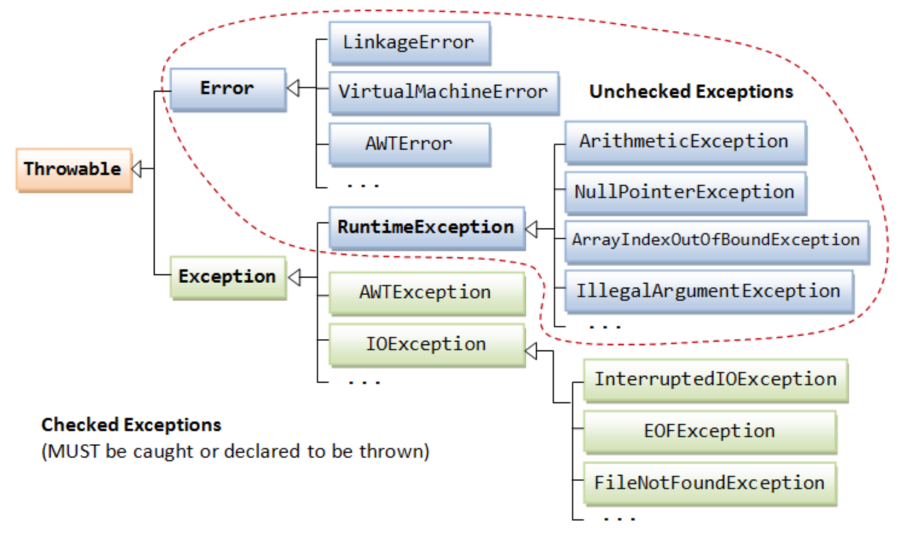

 

## 9주차 과제: 예외 처리
자바의 예외 처리에 대해 학습하세요.
*** 
### 학습할 것 (필수)
- 자바에서 예외 처리 방법 (try, catch, throw, throws, finally)
- 자바가 제공하는 예외 계층 구조
- Exception과 Error의 차이는?
- RuntimeException과 RE가 아닌 것의 차이는?
- 커스텀한 예외 만드는 방법
***
    

# 자바에서 예외 처리 방법 (try, catch, throw, throws, finally)
### try/catch/finally 
예외를 처리하는 방법 중 하나는 try/catch/finally 문이 있다. 
try절은 실행하려는 코드를 작성하는 블록이고, try 블록에는 0개 이상의 catch절이 따라온다. 
catch절은 처리할 예외를 나타낸다. 여러개의 catch절을 작성할 경우, 위에서부터 예외를 찾는다. 
마지막으로 finally는 try 블록에서 발생하는 상황에 관계없이 실행되는 코드를 작성하는 블록이며, finally가 필요하지 않으면 반드시 명시할 필요는 없다. 
<pre>
try {
    // 코드 블록. 
}
catch (SomeException e1) { // 첫번째로 찾을 예외.
    // 예외가 발생하면 실행할 내용. 
} catch (AnotherException | YetAnotherException e2) { // 두번째로 AnotherException 혹은 YetAnotherException 예외를 찾는다.
    // 예외가 발생하면 실행할 내용. 
} finally {
    // try 블록의 코드에서 발생하는 상황에 관계없이 실행된다.
}
</pre>
### throw
throw는 예외를 발생시킬 때 사용한다.
<pre>
if(x < 0) {
    throw new IllegalArgumentException("반드시 x는 0이거나 0보다 커야 합니다."); 
}
</pre>
위와 같이 x값이 0보다 작을 경우 IllegalArgumentException을 발생시키면서 '반드시 x는 0이거나 0보다 커야 합니다.'라는 에러 메시지를 줄 수 있다.  
### throws
throws는 예외가 발생한 경우 예외를 예외가 발생한 해당 메소드를 실행한 곳으로 던질 때 사용한다. 
해당 메소드를 호출했던 곳으로 예외를 떠넘기는 것이다.  
<pre>
public static int estimateHomepageSize(String host) throws IOException { // IOException이 발생할 경우 던진다. 
    URL url = new URL("htp://"+ host +"/");
    try (InputStream in = url.openStream()) {
        return in.available(); 
    }
}
</pre>
떠넘겨진 예외를 이전 메소드에서 처리해줘야 한다. 
<pre>
public static void main(String[] args) {
    try {
        estimateHomepageSize("homepage.com");
    } catch(IOException ie) { // 위에서 IOException 예외 발생 시 예외 처리를 한다.
        ...
    }
}
</pre>
만약 main()에서도 예외를 처리하지 않고 
throws로 예외를 던지게 되면 예외 발생 시 프로그램이 종료된다.  
<pre>
public static void main(String[] args) throws IOException { // IOException을 던지는 main()
    int result = estimateHomepageSize("homepage.com"); // 예외처리를 하지 않았다.
    System.out.println("# result: " + result); // 위에서 IOException 발생 시 프로그램이 종료되어 실행되지 않는다. 
}
</pre> 

### * try-with-resources
#### 자바 7버전 이상 try-with-resources
자바 7버전 부터 try-with-resources를 사용하면 try에 자원을 할당하고, try 실행이 끝나면, catch로 들어가기 전에 자동으로 자원이 close()된다.
<pre>
BufferedReader tempBr = new BufferedReader(new FileReader(filePath));
try(BufferedReader br = tempBr) { // 하지만, tempBr로 임시 저장을 해서 넘겨줘야 하는 번거로움이 있다. (이 부분이 자바9에서 또 개선되었다.)
    String str;
    while((str = br.readLine()) != null) {
        System.out.println(str);
    }
} catch (IOException e) {
    e.printStackTrace();
}
</pre>
#### * 자바 9버전 이상 try-with-resources 개선 
자바 9버전 부터 try 밖에서 선언된 변수를 try문에서 자원으로 사용할 수 있다. 
주의할 점은 사용할 변수가 final이거나 effectively final(초기화 된 이후에 절대 바뀌지 않는 변수)이어야 한다는 점이다. 
<pre>
BufferedReader br1 = new BufferedReader(new FileReader(filePath1));
BufferedReader br2 = new BufferedReader(new FileReader(filePath2));
try(br1; br2) { // 복수개의 자원도 가능하다.
    String str;
    while((str = br1.readLine()) != null) {
        System.out.println(str);
    }
    while((str = br2.readLine()) != null) {
        System.out.println(str);
    }
} catch (IOException e) {
    e.printStackTrace();
}
</pre>
    

# 자바가 제공하는 예외 계층 구조
(Exception과 Error에 관계없이 예외 객체를 지칭하기 위해 '예외'라는 용어를 사용한다.) 
자바의 예외 또한 Object이다. 
자바의 예외는 'java.lang.Throwable'과 그 하위 클래스들로 이루어져 있다. 
'java.lang.Throwable'에는 'java.lang.Error'와 'java.lang.Exception' 두가지 표준 하위 클래스가 있다.  
 
###### (이미지 출처: https://www.startertutorials.com/corejava/exception-handling-overview.html)  
예외는 객체이기 때문에 데이터를 포함할 수 있으며, 해당 클래스는 해당 데이터를 사용하는 메서드를 정의할 수 있다. 
Throwable 클래스와 모든 하위 클래스는 예외 조건을 설명하는 오류 메시지를 읽을 수 있도록  
오류 메시지를 저장하는 String 필드가 포함되어 있다. 
예외 객체가 생성될 때 설정되며 getMessage() 메서드를 사용하여 예외 메시지를 읽을 수 있다. 
    

# Exception과 Error의 차이는?
#### Error
Error는 복구할 수 없는 문제를 나타낸다. 
예를 들어, 메모리가 부족하거나 클래스 파일이 손상되어 읽을 수 없는 경우 등 주로 JVM에서 발생시키는 예외이다. 
이를 미리 예측하고 처리하는 것이 가능할 수도 있겠지만 그런 경우는 거의 없다.  
이러한 예외를 unchecked 예외라고 한다. 
unchecked 예외는 예외 발생 시 트랜잭션을 roll-back 한다.  
#### Exception 
반면, Exception은 그보다 덜 심각한 문제를 나타낸다.  
예를 들어, 파일을 읽다가 파일 내용이 끝났음을 알리는 java.io.EOFException, 
프로그램이 배열을 읽다가 배열 길이를 초과해서 읽으려는 경우 java.lang.ArrayIndexOutOfBoundsException이 발생한다.  
보통 Exception은 미리 발견하고 예외를 처리할 수 있다.   
ArrayIndexOutOfBoundsException과 같이 RuntimeException을 상속받는 Exception은 unchecked 예외이며,
EOFException과 같이 RuntimeException을 상속받지 않는 Exception은 checked 예외라고 한다.
checked 예외는 컴파일 단계에서 컴파일러가 발견하고 이 예외 때문에 컴파일 할 수 없으니 예외를 처리하라고 알려준다. 
때문에 반드시 예외를 처리해야만 컴파일을 할 수 있다.  
checked 예외는 예외 발생 시 트랜잭션을 roll-back 하지 않고, 예외를 던져준다.  
    

# RuntimeException과 RE가 아닌 것의 차이는?
Exception 하위 클래스에서  
RuntimeException과 RuntimeException을 상속받는 Exception은 unchecked 예외이기 때문에 명시적으로 처리하지 않아도 된다. 
반면, RuntimeException을 상속받지 않는 이외의 클래스들은 checked 예외이며 반드시 명시적으로 예외 처리를 해줘야 한다. 
그래서 예외처리를 강제하고 싶을 경우에는 checked, 강제하고 싶지 않을 경우에는 unchecked 예외를 던지도록 만들 수 있다. 
RuntimeException은 명시적으로 처리하지 않아도 되지만 미리 예외가 발생하지 않도록 코드를 작성하여 처리하는 것이 가능하다. 
    

# 커스텀한 예외 만드는 방법

    